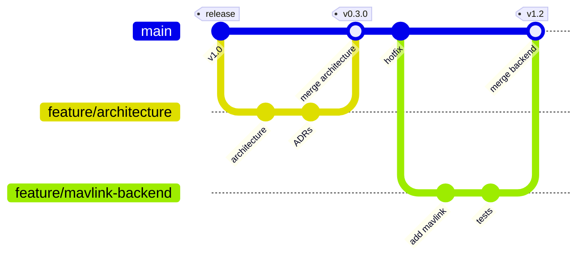

# Development Process

## Git Workflow

We use a feature-branch workflow with pull requests.  

**How we use it**
1. **Main branch** – protected. All changes go through PRs.
2. **Feature branches** – created from main for each issue (e.g., 40-write-tests).
3. **Pull requests** – required for all changes. At least one approval needed.
4. **CI** – runs on every PR and push to main (tests, linters, link checks).
5. **Merging** – after review and passing CI.

**Work Status**
We use GitHub issues with status labels:

- **To Do** – not started
- **In Progress** – currently working
- **Done** – merged and closed

**Definition of Done**  
See [Definition Of Done](definition-of-done.md).
